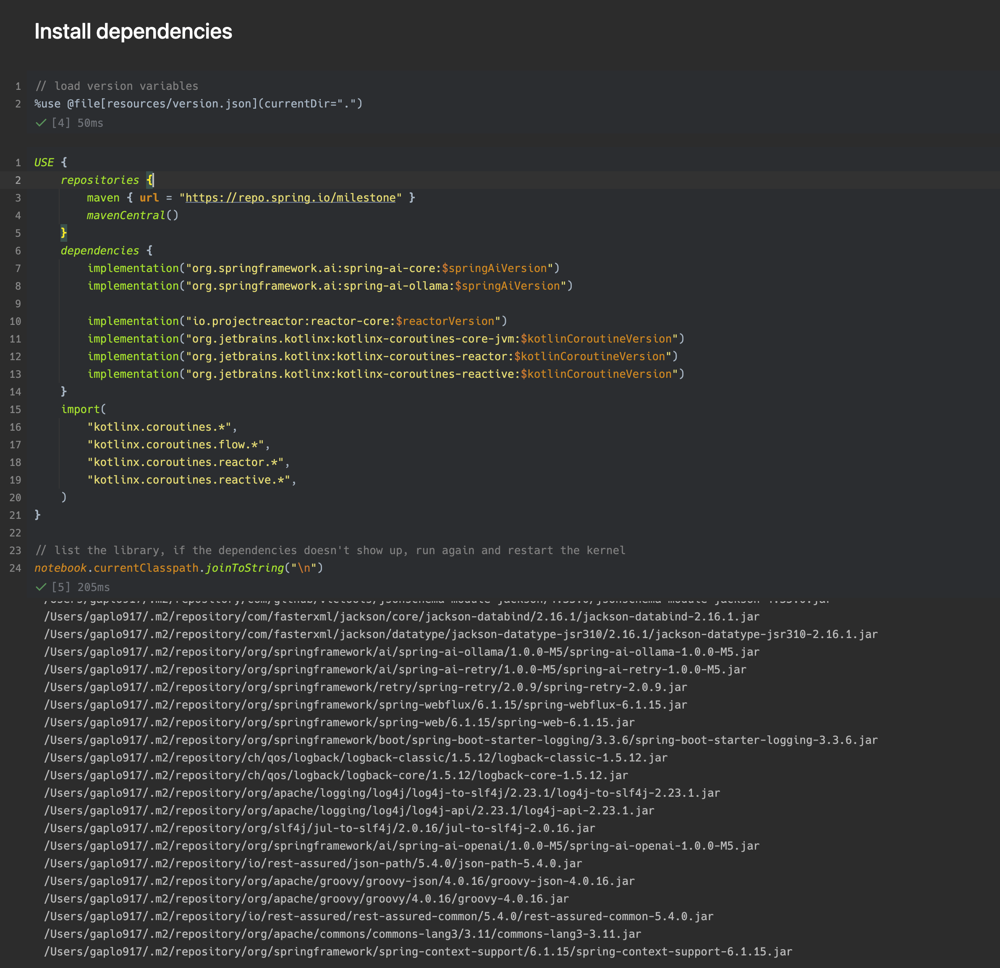

# Awesome Kotlin Notebooks
A curated list of awesome Kotlin Notebook that can be run instantly in IntelliJ to 
accelerate building Kotlin experiments using 3rd party libraries! 

If you are a kotlin beginning, follow the `README.md` to run the notebook to learn different libraries.

If you are a java/kotlin library owner, showcase your library using Kotlin Notebook and 
allow others to run, learn and contribute together!

## List of Kotlin Notebookes

* [Spring AI](spring-ai/)
  * [Ollama example](spring-ai/spring-ai-ollama.ipynb)
  * [OpenAI example](spring-ai/spring-ai-openai.ipynb)
* [Neo4j](neo4j/)
  * [Neo4J query](neo4j/neo4j-vanilla.ipynb)
* [PostgreSQL](postgres/)
  * [PostgreSQL query and visualize dataframe](postgres/postgres-vanilla.ipynb)
* [Langchain(Planned)](langchain/)
* [Kotlin new features by version(Planned)](kotlin-new-feature-by-version/)
* ... more

You might also interested to read the [official Kotlin Notebooks sample](https://github.com/Kotlin/kotlin-jupyter/tree/master/samples).

## Folder structure design
To ease the dependency version upgrade and minimize manual error, I setup a convention to store dependency version and
API secret.

Here is the reference folder structure.
```
.
└── spring-ai/
    ├── resources/
    │   ├── version.json
    │   └── openai.secret.json (openai.example.json for reference)
    ├── spring-ai-openai.ipynb
    └── spring-ai-ollama.ipynb
```

Load the `version.json` variables
```jupyter
%use @file[resources/version.json](currentDir=".")
```
For example, the following `version.json` will create the variables for Kotlin Notebook.
```json
{
  "properties": {
    "SPRING_AI_VERSION": "1.0.0-M5",
    "KOTLIN_COROUTINE_VERSION": "1.9.0",
    "REACTOR_VERSION": "3.7.1"
  },
  "init": [
    "val springAiVersion = \"$SPRING_AI_VERSION\"",
    "val kotlinCoroutineVersion = \"$KOTLIN_COROUTINE_VERSION\"",
    "val reactorVersion = \"$REACTOR_VERSION\""
  ]
}
```
Screenshots:


### Major version upgarde
In case there is a major version upgrade for the third party library that contains breakchanges. 
Please create another variable.
```diff
{
  "properties": {
    "SPRING_AI_VERSION": "1.0.0-M5",
+   "SPRING_AI_V2_VERSION": "2.0.0",
    "KOTLIN_COROUTINE_VERSION": "1.9.0",
    "REACTOR_VERSION": "3.7.1"
  },
  "init": [
    "val springAiVersion = \"$SPRING_AI_VERSION\"",
    "val springAiV2Version = \"$SPRING_AI_V2_VERSION\"",
    "val kotlinCoroutineVersion = \"$KOTLIN_COROUTINE_VERSION\"",
    "val reactorVersion = \"$REACTOR_VERSION\""
  ]
}
```
