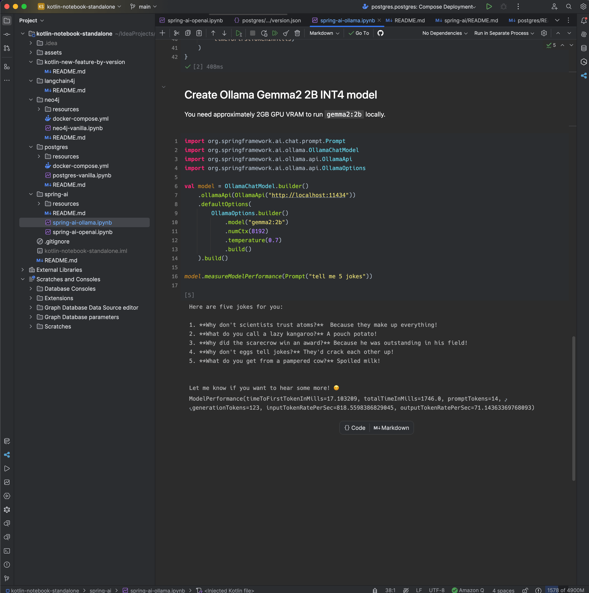
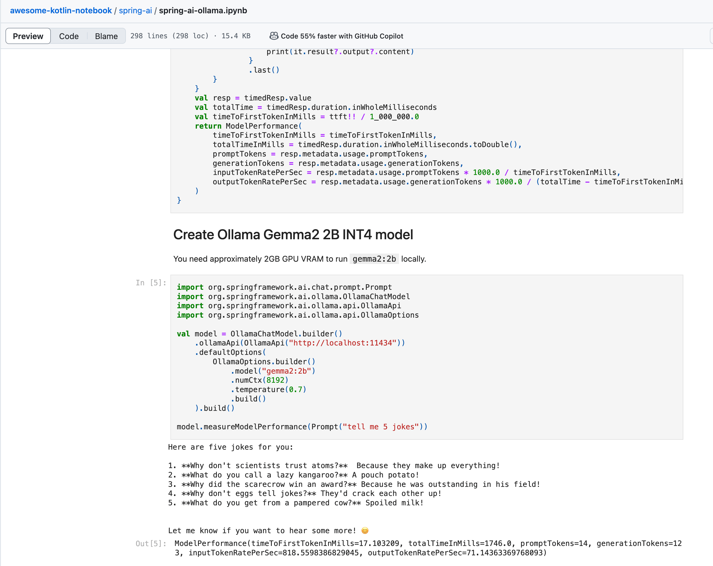

# Awesome Kotlin Notebooks
A curated list of awesome Kotlin Notebook that can be run instantly in IntelliJ to 
accelerate building Kotlin experiments, especially GenAI PoC, using 3rd party libraries! 

If you are a kotlin beginning, follow the `README.md` to run the notebook to learn different libraries.

If you are a java/kotlin library owner, showcase your library using Kotlin Notebook and 
allow others to run, learn and contribute together!

## List of Kotlin Notebooks

* [Spring AI](spring-ai/)
  * [Ollama example](spring-ai/spring-ai-ollama.ipynb)
  * [OpenAI example](spring-ai/spring-ai-openai.ipynb)
* [Neo4j](neo4j/)
  * [Neo4J query](neo4j/neo4j-vanilla.ipynb)
* [PostgreSQL](postgres/)
  * [PostgreSQL query and visualize dataframe](postgres/postgres-vanilla.ipynb)
* [AWS SDK for Kotlin](aws-sdk-for-kotlin)
  * [Amazon S3](aws-sdk-for-kotlin/aws-sdk-s3.ipynb)
  * [Bedrock](aws-sdk-for-kotlin/aws-sdk-bedrock.ipynb)
  * [Bedrock Runtime Converse](aws-sdk-for-kotlin/aws-sdk-bedrock-converse.ipynb)
* [Google GenAI SDK](google-genai-sdk)
  * [Gemini](google-genai-sdk/gemini-examples.ipynb)
* [langchain4j](langchain4j/)
  * [MCP Client Vertex AI](langchain4j/langchain4j-mcp-client-vertexai.ipynb)
* [GCP SDK(Planned)]
* [Azure SDK(Planned)]
* ... more
* Feel free to share your Kotlin Notebook to accelerate together

You might also be interested to read the [official Kotlin Notebooks sample](https://github.com/Kotlin/kotlin-jupyter/tree/master/samples).

## Folder structure design
To ease the dependency version upgrade and minimize manual error, I setup a convention to store dependency version and
API secret.

Here is the reference folder structure.
```
.
└── spring-ai/
    ├── resources/
    │   └── openai.secret.json (openai.example.json for reference)
    ├── spring-ai-openai.ipynb
    └── spring-ai-ollama.ipynb
```

### GCP local development
Your local Kotlin Notebook can load your GCP application credential after you autheticate with the follow commands. 

```bash
gcloud auth application-default login
```

## New to Kotlin Notebook?
You can write a self-documented notebook that combine source code and run result. 
Those results can be directly read on GitHub. Getting started here: https://kotlinlang.org/docs/kotlin-notebook-set-up-env.html 


